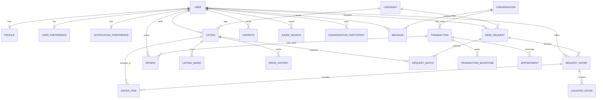
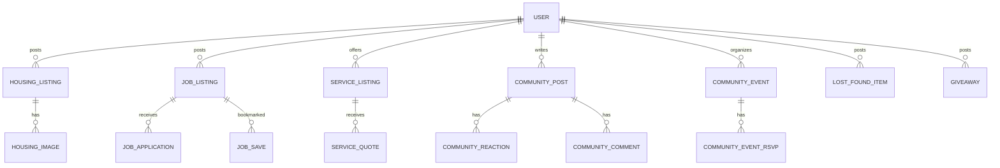

# Database Design

PostgreSQL via Prisma (`backend/prisma/schema.prisma`). Migrations: `backend/prisma/migrations/0001_init`, `backend/prisma/migrations/0002_onboarding`, `backend/prisma/migrations/0003_verticals`, and `backend/prisma/migrations/0004_trust_safety`. Client provider: `prisma-client-js`.

**IMPLEMENTED** is every model, enum, and index in that schema. **TARGET** is the rest of the older entity list that has no table. A model with no service writer is called out; it is still implemented schema, not a target table.

v1 does not add an embeddings table, a vector column, or a semantic-index job.

## IMPLEMENTED

### Enums

| Enum | Values |
| --- | --- |
| `UserStatus` | `ACTIVE`, `SUSPENDED`, `DELETED` |
| `ListingStatus` | `DRAFT`, `PUBLISHED`, `SOLD`, `ARCHIVED`, `DELETED` |
| `RequestStatus` | `DRAFT`, `PUBLISHED`, `CLOSED`, `EXPIRED`, `CANCELLED` |
| `OfferStatus` | `PENDING`, `COUNTERED`, `ACCEPTED`, `REJECTED`, `WITHDRAWN`, `EXPIRED` |
| `TransactionStatus` | `DRAFT`, `PUBLISHED`, `OFFER_RECEIVED`, `NEGOTIATING`, `ACCEPTED`, `SCHEDULED`, `IN_PROGRESS`, `COMPLETED`, `CANCELLED`, `DISPUTED`, `REFUNDED`, `EXPIRED` |
| `ExchangeMode` | `BUY`, `BORROW`, `RENT`, `HIRE`, `TRADE`, `SKILL_SWAP`, `FREE` |
| `PublishStatus` | `PUBLISHED`, `ARCHIVED` |
| `QuoteStatus` | `PENDING`, `ACCEPTED` |
| `StaffRole` | `MODERATOR`, `ADMIN` |
| `ReportTargetType` | `LISTING`, `USER`, `MESSAGE`, `COMMUNITY_POST` |
| `ReportReason` | `SPAM`, `SCAM`, `HARASSMENT`, `INAPPROPRIATE`, `OTHER` |
| `ReportStatus` | `OPEN`, `REVIEWING`, `RESOLVED`, `DISMISSED` |
| `ModerationActionKind` | `DISMISS`, `RESOLVE`, `HIDE`, `SUSPEND_USER`, `RESTORE_USER` |

Marketplace create handlers set listing and request status to `PUBLISHED`. Housing, jobs, services, community posts, events, lost-and-found, and giveaways do the same with `PublishStatus`. Owner delete sets `ARCHIVED` and `deletedAt`. Offer create leaves `PENDING`. Counter sets `COUNTERED`. Accept sets `ACCEPTED` and inserts the conversation and transaction. Transaction statuses after that change through `PATCH /transactions/:id/status`. Service quotes start `PENDING`; provider accept sets `ACCEPTED`.

### Identity

- `User` — `id` UUID, unique `email`, `passwordHash`, `status`, timestamps, `deletedAt`.
- `Profile` — 1:1 user. `firstName`, `lastName`, optional `displayName`, `bio`, `neighborhood`, `city`, `state`, decimal `latitude` / `longitude`, `phoneVerified`, `emailVerified` (both default false). No route sets the verified flags.
- `UserPreference` — JSON `interests`, JSON `capabilities`, `completedAt`. Written by onboarding.
- `NotificationPreference` — booleans `newListings`, `priceDrops`, `messages` (default true), `events`, `community` (default false). Written by onboarding. No notification rows exist.
- `StaffRoleAssignment` — `userId` + `StaffRole` (`MODERATOR` or `ADMIN`), unique together. No self-serve writer. Insert a row to grant the moderation queue.
- `BlockedUser` — `blockerId`, `blockedId`, unique together. Either direction blocks messaging and the other interactions listed in `docs/PHASE_3_TRUST_SAFETY.md`.
- `Report` — reporter, `targetType`, `targetId`, `reason`, optional `details`, `status`. Unique per reporter and target.
- `ModerationAction` — staff `actorId`, `kind`, optional `note`, linked to one report.
- `Message.hiddenAt` — set when staff hides a reported message. Participant reads replace the body with “This message was removed.”

### Catalog and listings

- `Category` — unique `name`, unique `slug`. Seeded. Referenced by `Listing` and `NeedRequest`.
- `Listing` — seller, category, title, description, optional `priceCents`, `condition`, status, neighborhood, city, decimal lat/lng, `radiusMiles`, pickup (default true), delivery and shipping (default false), `deletedAt`. Indexes: `[status, categoryId, createdAt]`, `[sellerId, status]`, `[city, neighborhood]`.
- `ListingImage` — `objectKey`, `sortOrder`. No upload path writes it.
- `Favorite` — composite id `(userId, listingId)`.
- `SavedSearch` — `query`, JSON `filters`.
- `PriceHistory` — `listingId`, `priceCents`, `createdAt`. **No writer.**

### Requests

- `NeedRequest` — requester, category, title, description, optional `budgetCents`, decimal lat/lng, `radiusMiles` default 10, `deadline`, `urgency`, `mode`, status, `deletedAt`. Indexes: `[requesterId, status, createdAt]`, `[categoryId, status]`.
- `RequestOffer` — request, offerer (`Offerer` relation), optional `amountCents`, `message`, status. Indexes: `[requestId, status, createdAt]`, `[offererId, status]`.
- `OfferItem` — offer + listing, unique `(offerId, listingId)`.
- `CounterOffer` — offer, `fromUserId` (plain UUID, no User relation), optional `amountCents`, `message`.
- `RequestMatch` — request + listing, unique pair, `score` `Decimal(5, 2)`. **No writer.** Not a vector store.

### Conversations

- `Conversation` — timestamps, participants, messages, optional transactions.
- `ConversationParticipant` — composite id, `joinedAt`, `lastReadAt`.
- `Message` — `body`, `senderId`, index `[conversationId, createdAt]`. No attachment or per-message receipt table.

Offer accept and `POST /conversations` insert `Conversation` and `ConversationParticipant`. `POST /conversations` does not add a `listingId` column. It reuses a thread whose participants are exactly those two users, then writes `Message` the same way as `POST /conversations/:id/messages`.

### Transactions and reviews

- `Transaction` — optional `conversationId`, optional `offerId` (no FK to `RequestOffer`), status. Includes participants, milestones, appointments, reviews.
- `TransactionParticipant` — composite id, string `role`.
- `TransactionMilestone` — `fromStatus`, `toStatus`. Written by the status patch.
- `Appointment` — `startsAt`, `locationNote`. **No writer.** Included when transactions are listed.
- `Review` — `transactionId`, `authorId`, `subjectId`, `rating` int, `body`. Written by `POST /reviews` when the transaction is `COMPLETED`. No unique constraint yet.

### What the schema does not do

- No PostGIS `geometry`. Latitude and longitude are `Decimal(9, 6)`. The compose image is `postgis/postgis:16-3.4`; the migration does not use it.
- No full-text index. Search is application `contains`.
- No soft-delete on offers, messages, or reviews.
- No money, payout, refund, or dispute tables. Dispute is only a transaction status.

### Housing, jobs, services, and community

Added in `0003_verticals`. Screens still read `src/data/index.ts` until the wiring PR. Seed rows in `backend/prisma/seed.ts` follow those fixtures (dollars converted to cents). Local seed users are `seed.<firstname>@example.com`. The shared password is `SEED_PASSWORD` in that file, for local boot only.

Latitude and longitude on housing, jobs, and services are write-only. Public selects omit them. Profile coordinates stay off the public card. Service quote `address` is stored and returned to the requester, and to the provider only after `ACCEPTED`.

`verified`, `backgroundCheck`, `rating`, and `reviewCount` are columns the API does not accept from clients. Seed writes them.

- `HousingListing` — owner, `propertyType` (Apartment, House, Room, Studio, Condo, Sublet), `listingType` (`rent` or `sale`), `priceCents`, optional `priceUnit`, beds, baths, sqft, neighborhood, city, `available`, `lease`, pets, furnished, utilities, verified, `PublishStatus`, write-only lat/lng, `deletedAt`. `HousingImage.objectKey` is the unsplash id the card already uses. Indexes: `[status, listingType, createdAt]`, `[ownerId, status]`, `[city, neighborhood]`.
- `JobListing` — owner, title, company, `logoKey`, description, `responsibilities` text array, `employmentType` (Full-time, Part-time, Freelance, Internship), `level`, `salary` display string, location, `remote` (Remote, Hybrid, On-site), deadline, `tags`, verified, write-only lat/lng. `JobApplication` is unique on `(jobId, applicantId)`. `JobSave` is composite `(userId, jobId)`.
- `ServiceListing` — owner, title, `businessName`, description, `category` (the Services pills), `startingPriceCents`, location, availability, tags, `imageKey`, `backgroundCheck`, `rating` `Decimal(2, 1)`, `reviewCount`. `ServiceQuote` stores `preferredDate`, `preferredTime`, `notes`, private `address`, and `QuoteStatus`.
- `CommunityPost` — author, `type` (discussion, announcement, lost_found, recommendation, event, giveaway), title, body, neighborhood, city. `CommunityReaction` is one emoji per `(postId, userId)` (`👍`, `❤️`, `😮`). `CommunityComment` is the reply.
- `CommunityEvent` — organizer, title, description, neighborhood, city, `dateLabel`, `timeLabel`, `imageKey`. `CommunityEventRsvp` is composite `(eventId, userId)`. `attending` in the API is the RSVP count, not a stored column.
- `LostFoundItem` — author, `kind` (`lost` or `found`; the API calls it `type`), item, neighborhood, city, `imageKey`.
- `Giveaway` — author, item, neighborhood, city, `claimed`, optional `claimedById`. Public reads do not include `claimedBy`.

## TARGET

Tables and constraints the earlier design named that are **not** in `schema.prisma`. Do not document UI as if these exist.

### Identity and safety

`Verification`, `DeviceSession`. `StaffRoleAssignment` and `BlockedUser` are implemented (see above).

### Marketplace extras

`ListingCategory` (category is a single FK today), `ListingAttribute`, `ListingAvailability`, `ListingLocation` (location columns live on `Listing`), `Wishlist` separate from `Favorite`.

### Request extras

`RequestCategory`, `RequestRequirement`, `OfferStatusHistory`, `MatchPreference`.

### Money and disputes

`Payment`, `Payout`, `Refund`, `Dispute`, `Evidence`, `GuaranteeClaim`, `PickupDetails` (appointment has `locationNote` only).

### Messaging extras

`MessageAttachment`, `MessageReadReceipt`, `TypingStatus`.

### Trust extras

`ReviewResponse`, `TrustPassport`, `TrustEvent`, `ReputationMetric`, `SafetyIncident`. `Report` and `ModerationAction` are implemented. Profile stars and "Verified Neighbor" on Dashboard and Profile are fixture copy, not these tables.

### Community and verticals

`Neighborhood`, `TrustCircle`, `TrustCircleMember`, `NeighborhoodMission`, `MissionContributor`, `MissionTask`, `CommunityGoal`, `CommunityVote`, `VehicleListing`, `BorrowAgreement`, `SkillSwap`, `Bounty`, `Team`, `Bundle`, `BundleItem`.

`HousingListing`, `JobListing`, `ServiceListing`, `ServiceQuote`, `CommunityPost`, `CommunityComment`, `CommunityReaction`, `CommunityEvent`, `LostFoundItem`, and `Giveaway` are implemented (see above). The older names `ServiceProviderProfile` and `ServiceOffer` were not added. Housing, jobs, services, and community screens still read `src/data/index.ts` until the wiring PR.

### Target constraints worth keeping when those tables are added

- UUID primary keys, `createdAt` / `updatedAt`, and `deletedAt` on user-generated content that can be moderated.
- Unique active conversation membership.
- One `Review` per `(transactionId, authorId)`.
- Check constraints for non-negative cents and legal status values (enums already cover status).
- A real geo column and GiST index when radius search is built. Until then, do not claim PostGIS queries work.
- Full-text index on listing and request text as ordinary Postgres text search. Not embeddings.

### Schema rows that still have no writer

Accept creates `Conversation`, `ConversationParticipant`, `Transaction`, and `TransactionParticipant`. `POST /reviews` writes `Review`. These still have no insert route:

| Model | Needed for |
| --- | --- |
| `Appointment` | Dashboard meetup cards |
| `RequestMatch` | Any "matches" list (deterministic, not semantic) |
| `PriceHistory` | Saved Items price alerts without the fake $100 drop |
| `ListingImage` | Create Listing photos |
