# Database Design

## 1. Design goals

The data model should reflect the actual marketplace flow and the current frontend inventory. The main design requirement is to support request-first commerce, not just item posting.

The schema must provide:

- normalized relational data for users, listings, requests, offers, and transactions
- geospatial indexing and search support
- soft delete and audit trails for user-generated content
- clear trust and moderation data
- support for neighborhood-level community features

## 2. Entity relationship overview

```mermaid
erDiagram
    USER ||--o{ PROFILE : has
    USER ||--o{ VERIFICATION : has
    USER ||--o{ USER_ROLE : has
    USER ||--o{ USER_PREFERENCE : has
    USER ||--o{ DEVICE_SESSION : has
    USER ||--o{ BLOCKED_USER : blocks
    USER ||--o{ LISTING : creates
    USER ||--o{ NEED_REQUEST : creates
    USER ||--o{ CONVERSATION_PARTICIPANT : joins
    USER ||--o{ REVIEW : writes
    USER ||--o{ REPORT : files

    LISTING ||--o{ LISTING_IMAGE : has
    LISTING ||--o{ LISTING_CATEGORY : tags
    LISTING ||--o{ LISTING_ATTRIBUTE : has
    LISTING ||--o{ LISTING_AVAILABILITY : has
    LISTING ||--o{ LISTING_LOCATION : has
    LISTING ||--o{ FAVORITE : saved_by
    LISTING ||--o{ PRICE_HISTORY : tracks

    NEED_REQUEST ||--o{ REQUEST_CATEGORY : tags
    NEED_REQUEST ||--o{ REQUEST_REQUIREMENT : has
    NEED_REQUEST ||--o{ REQUEST_OFFER : receives
    NEED_REQUEST ||--o{ REQUEST_MATCH : matches

    REQUEST_OFFER ||--o{ OFFER_ITEM : includes
    REQUEST_OFFER ||--o{ COUNTER_OFFER : has
    REQUEST_OFFER ||--o{ OFFER_STATUS_HISTORY : tracks

    TRANSACTION ||--o{ TRANSACTION_PARTICIPANT : has
    TRANSACTION ||--o{ TRANSACTION_MILESTONE : tracks
    TRANSACTION ||--o{ APPOINTMENT : schedules
    TRANSACTION ||--o{ PAYMENT : records
    TRANSACTION ||--o{ PAYOUT : settles
    TRANSACTION ||--o{ REFUND : resolves
    TRANSACTION ||--o{ DISPUTE : has

    CONVERSATION ||--o{ CONVERSATION_PARTICIPANT : includes
    CONVERSATION ||--o{ MESSAGE : contains
    MESSAGE ||--o{ MESSAGE_ATTACHMENT : has
    MESSAGE ||--o{ MESSAGE_READ_RECEIPT : records

    USER ||--o{ TRUST_PASSPORT : owns
    TRUST_PASSPORT ||--o{ TRUST_EVENT : emits
    TRUST_PASSPORT ||--o{ REPUTATION_METRIC : aggregates
    USER ||--o{ REVIEW_RESPONSE : responds_to
    REVIEW ||--o{ REVIEW_RESPONSE : supports

    NEIGHBORHOOD ||--o{ COMMUNITY_POST : hosts
    COMMUNITY_POST ||--o{ COMMUNITY_COMMENT : has
    COMMUNITY_POST ||--o{ COMMUNITY_REACTION : gets
    NEIGHBORHOOD ||--o{ COMMUNITY_EVENT : schedules
    NEIGHBORHOOD ||--o{ COMMUNITY_GOAL : defines
    COMMUNITY_GOAL ||--o{ COMMUNITY_VOTE : receives
    COMMUNITY_GOAL ||--o{ NEIGHBORHOOD_MISSION : contains
    NEIGHBORHOOD_MISSION ||--o{ MISSION_CONTRIBUTOR : supports
    NEIGHBORHOOD_MISSION ||--o{ MISSION_TASK : has
```

## 3. Core Prisma models

At minimum, the schema should include the following models and relationships:

### Identity and accounts

- `User`
- `Profile`
- `Verification`
- `UserRole`
- `UserPreference`
- `NotificationPreference`
- `DeviceSession`
- `BlockedUser`

### Marketplace

- `Listing`
- `ListingImage`
- `ListingCategory`
- `ListingAttribute`
- `ListingAvailability`
- `ListingLocation`
- `Favorite`
- `SavedSearch`
- `Wishlist`
- `PriceHistory`

### Request-first commerce

- `NeedRequest`
- `RequestCategory`
- `RequestRequirement`
- `RequestOffer`
- `OfferItem`
- `OfferStatusHistory`
- `CounterOffer`
- `RequestMatch`
- `MatchPreference`

### Transactions

- `Transaction`
- `TransactionParticipant`
- `TransactionMilestone`
- `Appointment`
- `PickupDetails`
- `Payment`
- `Payout`
- `Refund`
- `Dispute`
- `Evidence`
- `GuaranteeClaim`

### Communication

- `Conversation`
- `ConversationParticipant`
- `Message`
- `MessageAttachment`
- `MessageReadReceipt`
- `TypingStatus`

### Trust

- `Review`
- `ReviewResponse`
- `TrustPassport`
- `TrustEvent`
- `ReputationMetric`
- `Report`
- `ModerationAction`
- `SafetyIncident`

### Community

- `Neighborhood`
- `TrustCircle`
- `TrustCircleMember`
- `CommunityPost`
- `CommunityComment`
- `CommunityReaction`
- `CommunityEvent`
- `NeighborhoodMission`
- `MissionContributor`
- `MissionTask`
- `CommunityGoal`
- `CommunityVote`

### Specialized categories

- `HousingListing`
- `JobListing`
- `ServiceProviderProfile`
- `ServiceOffer`
- `VehicleListing`
- `BorrowAgreement`
- `SkillSwap`
- `Bounty`
- `Team`
- `Bundle`
- `BundleItem`

## 4. Required data quality patterns

- Use UUID primary keys for most user-generated records
- Add `createdAt`, `updatedAt`, and `deletedAt` timestamps consistently
- Use soft deletes for any content that can be moderated or reported
- Add correlation IDs for event-driven operations
- Add appropriate indexes on `userId`, `status`, `category`, and geospatial columns
- Use Prisma enums for lifecycle statuses and trust severity levels

## 5. Recommended indexes

Key indexes should include:

- `Listing(userId, status, createdAt)`
- `Listing(category, status, neighborhoodId)`
- `NeedRequest(userId, status, createdAt)`
- `RequestOffer(requestId, status)`
- `ConversationParticipant(userId, conversationId)`
- `Message(conversationId, createdAt)`
- `Review(targetUserId, createdAt)`
- `CommunityPost(neighborhoodId, createdAt)`
- PostGIS index on `ListingLocation` and `Neighborhood` geometry fields
- Full-text indexes on listing titles/descriptions and request text

## 6. Security and integrity controls

- Prevent direct deletion of immutable trust records
- Require explicit `userId` ownership checks for edits and deletes
- Enforce transaction-level integrity for order, payment, and settlement records
- Use unique constraints for active conversations and one-to-one participant records
- Use DB-level checks for price, status, and scheduled date validity

## 7. Example Prisma modeling strategy

The schema should use clear domain modules and careful relation naming. The first release should prioritize correctness over over-normalization, but still avoid duplication of key facts such as reputation, availability, location, and pricing history.

This is especially important for the request-first flow because a single request can spawn multiple offers and a single listing can be matched to many requests across different neighborhoods and categories.
