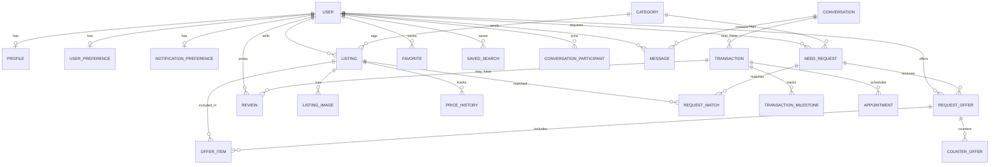

# Database Design

PostgreSQL via Prisma (`backend/prisma/schema.prisma`). Migrations: `backend/prisma/migrations/0001_init` and `backend/prisma/migrations/0002_onboarding`. Client provider: `prisma-client-js`.

**IMPLEMENTED** is every model, enum, and index in that schema. **TARGET** is the rest of the older entity list that has no table. A model with no service writer is called out; it is still implemented schema, not a target table.

v1 does not add an embeddings table, a vector column, or a semantic-index job.

## IMPLEMENTED

### Enums

| Enum | Values |
| --- | --- |
| `UserStatus` | `ACTIVE`, `SUSPENDED`, `DELETED` |
| `ListingStatus` | `DRAFT`, `PUBLISHED`, `SOLD`, `ARCHIVED`, `DELETED` |
| `RequestStatus` | `DRAFT`, `PUBLISHED`, `CLOSED`, `EXPIRED`, `CANCELLED` |
| `OfferStatus` | `PENDING`, `COUNTERED`, `ACCEPTED`, `REJECTED`, `WITHDRAWN`, `EXPIRED` |
| `TransactionStatus` | `DRAFT`, `PUBLISHED`, `OFFER_RECEIVED`, `NEGOTIATING`, `ACCEPTED`, `SCHEDULED`, `IN_PROGRESS`, `COMPLETED`, `CANCELLED`, `DISPUTED`, `REFUNDED`, `EXPIRED` |
| `ExchangeMode` | `BUY`, `BORROW`, `RENT`, `HIRE`, `TRADE`, `SKILL_SWAP`, `FREE` |

Create handlers set listing and request status to `PUBLISHED` only. Offer create leaves `PENDING`. Counter sets `COUNTERED`. Other listing, request, and offer statuses have no writer. Transaction statuses change only through `PATCH /transactions/:id/status`, and nothing inserts a transaction.

### Identity

- `User` — `id` UUID, unique `email`, `passwordHash`, `status`, timestamps, `deletedAt`.
- `Profile` — 1:1 user. `firstName`, `lastName`, optional `displayName`, `bio`, `neighborhood`, `city`, `state`, decimal `latitude` / `longitude`, `phoneVerified`, `emailVerified` (both default false). No route sets the verified flags.
- `UserPreference` — JSON `interests`, JSON `capabilities`, `completedAt`. Written by onboarding.
- `NotificationPreference` — booleans `newListings`, `priceDrops`, `messages` (default true), `events`, `community` (default false). Written by onboarding. No notification rows exist.

### Catalog and listings

- `Category` — unique `name`, unique `slug`. Seeded. Referenced by `Listing` and `NeedRequest`.
- `Listing` — seller, category, title, description, optional `priceCents`, `condition`, status, neighborhood, city, decimal lat/lng, `radiusMiles`, pickup (default true), delivery and shipping (default false), `deletedAt`. Indexes: `[status, categoryId, createdAt]`, `[sellerId, status]`, `[city, neighborhood]`.
- `ListingImage` — `objectKey`, `sortOrder`. No upload path writes it.
- `Favorite` — composite id `(userId, listingId)`.
- `SavedSearch` — `query`, JSON `filters`.
- `PriceHistory` — `listingId`, `priceCents`, `createdAt`. **No writer.**

### Requests

- `NeedRequest` — requester, category, title, description, optional `budgetCents`, decimal lat/lng, `radiusMiles` default 10, `deadline`, `urgency`, `mode`, status, `deletedAt`. Indexes: `[requesterId, status, createdAt]`, `[categoryId, status]`.
- `RequestOffer` — request, offerer (`Offerer` relation), optional `amountCents`, `message`, status. Indexes: `[requestId, status, createdAt]`, `[offererId, status]`.
- `OfferItem` — offer + listing, unique `(offerId, listingId)`.
- `CounterOffer` — offer, `fromUserId` (plain UUID, no User relation), optional `amountCents`, `message`.
- `RequestMatch` — request + listing, unique pair, `score` `Decimal(5, 2)`. **No writer.** Not a vector store.

### Conversations

- `Conversation` — timestamps, participants, messages, optional transactions.
- `ConversationParticipant` — composite id, `joinedAt`, `lastReadAt`.
- `Message` — `body`, `senderId`, index `[conversationId, createdAt]`. No attachment or per-message receipt table.

There is no API that inserts `Conversation` or `ConversationParticipant`.

### Transactions and reviews

- `Transaction` — optional `conversationId`, optional `offerId` (no FK to `RequestOffer`), status. Includes participants, milestones, appointments, reviews.
- `TransactionParticipant` — composite id, string `role`.
- `TransactionMilestone` — `fromStatus`, `toStatus`. Written by the status patch.
- `Appointment` — `startsAt`, `locationNote`. **No writer.** Included when transactions are listed.
- `Review` — `transactionId`, `authorId`, `subjectId`, `rating` int, `body`. **No writer and no reader.** No unique constraint yet.

### What the schema does not do

- No PostGIS `geometry`. Latitude and longitude are `Decimal(9, 6)`. The compose image is `postgis/postgis:16-3.4`; the migration does not use it.
- No full-text index. Search is application `contains`.
- No soft-delete on offers, messages, or reviews.
- No money, payout, refund, or dispute tables. Dispute is only a transaction status.

## TARGET

Tables and constraints the earlier design named that are **not** in `schema.prisma`. Do not document UI as if these exist.

### Identity and safety

`Verification`, `UserRole`, `DeviceSession`, `BlockedUser`.

### Marketplace extras

`ListingCategory` (category is a single FK today), `ListingAttribute`, `ListingAvailability`, `ListingLocation` (location columns live on `Listing`), `Wishlist` separate from `Favorite`.

### Request extras

`RequestCategory`, `RequestRequirement`, `OfferStatusHistory`, `MatchPreference`.

### Money and disputes

`Payment`, `Payout`, `Refund`, `Dispute`, `Evidence`, `GuaranteeClaim`, `PickupDetails` (appointment has `locationNote` only).

### Messaging extras

`MessageAttachment`, `MessageReadReceipt`, `TypingStatus`.

### Trust extras

`ReviewResponse`, `TrustPassport`, `TrustEvent`, `ReputationMetric`, `Report`, `ModerationAction`, `SafetyIncident`. Profile stars and "Verified Neighbor" on Dashboard and Profile are fixture copy, not these tables.

### Community and verticals

`Neighborhood`, `TrustCircle`, `TrustCircleMember`, `CommunityPost`, `CommunityComment`, `CommunityReaction`, `CommunityEvent`, `NeighborhoodMission`, `MissionContributor`, `MissionTask`, `CommunityGoal`, `CommunityVote`, `HousingListing`, `JobListing`, `ServiceProviderProfile`, `ServiceOffer`, `VehicleListing`, `BorrowAgreement`, `SkillSwap`, `Bounty`, `Team`, `Bundle`, `BundleItem`.

Housing, jobs, services, and community screens read `src/data/index.ts` only.

### Target constraints worth keeping when those tables are added

- UUID primary keys, `createdAt` / `updatedAt`, and `deletedAt` on user-generated content that can be moderated.
- Unique active conversation membership.
- One `Review` per `(transactionId, authorId)`.
- Check constraints for non-negative cents and legal status values (enums already cover status).
- A real geo column and GiST index when radius search is built. Until then, do not claim PostGIS queries work.
- Full-text index on listing and request text as ordinary Postgres text search. Not embeddings.

### Schema rows that need writers before the UX flow is real

Nova can rely on these tables only after a route inserts them. June is not adding the routes.

| Model | Needed for |
| --- | --- |
| `Conversation`, `ConversationParticipant` | Messages leaving fixtures |
| `Transaction`, `TransactionParticipant` | Dashboard progress and review eligibility |
| `Appointment` | Dashboard meetup cards |
| `Review` | Review submit |
| `RequestMatch` | Any "matches" list (deterministic, not semantic) |
| `PriceHistory` | Saved Items price alerts without the fake $100 drop |
| `ListingImage` | Create Listing photos |
